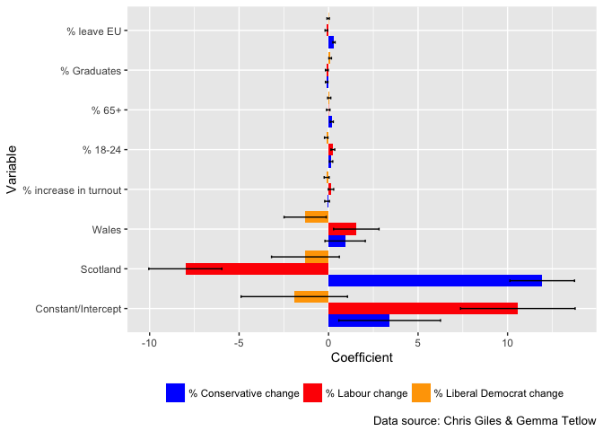
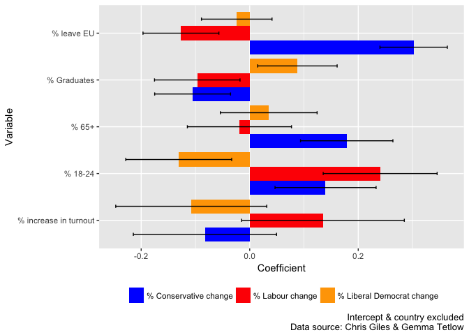

# UK General Election 2017: Visualising Vote Change Models
Ben Anderson (b.anderson@soton.ac.uk `@dataknut`)  
Last run at: `r Sys.time()`  

No doubt political science journals will soon be awash with papers explaining how the 8th June UK General Election 2017 results came to be. While we wait for these to wend their way through the writing and reviewing process, the FT's [Chris Giles](https://twitter.com/ChrisGiles_) and [Gemma Tetlow](https://twitter.com/gemmatetlow) provided us with some early insights as the results and data emerged on June 9th.

# Scatter plots

In particular they [tweeted](https://twitter.com/ChrisGiles_/status/873178948309577728) analysis of the percentage point change in vote share (so the change in the % of vote) in most of the constituencies that had declared to date with the exception of Northern Ireland. 

As an example the chart below shows the % point Conservative vote change against the % who voted to leave the EU. A pretty clear linear correlation with a few interesting looking outliers...

# Regression tables
More interestingly (for me) Chris also tweeted the [STATA regression model results](https://twitter.com/ChrisGiles_/status/873180690296307713/photo/1) that were used to draw the regression line in the above chart, in several other charts and in a series of [highlights](https://twitter.com/ChrisGiles_/status/873178948309577728) they tweeted.

Now I'm as fond of regression tables as the next data knut but I wondered if there might be a better way to look at them. Thanks to Chris's table-tweet, and relying on [Ben Goldacre's interpretation](https://twitter.com/bengoldacre/status/873210437327867905) of the variable labels, here are the basic results:

Table: % Labour vote share change regression results (Data source: Chris Giles & Gemma Tetlow)

varName                  Coefficient      SE   lowerCI   upperCI
----------------------  ------------  ------  --------  --------
% increase in turnout          0.135   0.076    -0.015     0.285
% leave EU                    -0.127   0.036    -0.197    -0.057
% Graduates                   -0.097   0.040    -0.175    -0.018
% 18-24                        0.240   0.054     0.135     0.345
% 65+                         -0.019   0.049    -0.115     0.077
Scotland                      -8.003   1.041   -10.043    -5.963
Wales                          1.549   0.648     0.280     2.819
Constant/Intercept            10.574   1.633     7.373    13.775

Table: % Conservative vote share change regression results (Data source: Chris Giles & Gemma Tetlow)

varName                  Coefficient      SE   lowerCI   upperCI
----------------------  ------------  ------  --------  --------
% increase in turnout         -0.083   0.067    -0.214     0.049
% leave EU                     0.302   0.032     0.240     0.364
% Graduates                   -0.105   0.036    -0.175    -0.035
% 18-24                        0.140   0.048     0.047     0.233
% 65+                          0.179   0.043     0.094     0.264
Scotland                      11.937   0.921    10.132    13.741
Wales                          0.925   0.575    -0.202     2.051
Constant/Intercept             3.413   1.449     0.573     6.253

Table: % Liberal Democrat vote share change regression results (Data source: Chris Giles & Gemma Tetlow)

varName                  Coefficient      SE   lowerCI   upperCI
----------------------  ------------  ------  --------  --------
% increase in turnout         -0.108   0.071    -0.247     0.031
% leave EU                    -0.024   0.033    -0.089     0.041
% Graduates                    0.088   0.037     0.015     0.161
% 18-24                       -0.131   0.050    -0.228    -0.033
% 65+                          0.035   0.045    -0.054     0.124
Scotland                      -1.293   0.967    -3.188     0.602
Wales                         -1.308   0.601    -2.486    -0.129
Constant/Intercept            -1.916   1.516    -4.888     1.056

Yes, I know this is no easier to read than the original but there is a reason they look like this. It makes them easier to plot (below) and I've only put them there so you can check them against the originals if you want to.

What do these numbers mean? Well:

 * the coefficient is the strength of the correlation between the variable (e.g. % who voted to leave the EU) and the % point change in vote share. As this is a multivariate regression model, this is a net correlation which takes account of (controls for) the other variables in the model. As an example, in the Labour vote share model, we can say that an increase of 1 unit in the % who voted to leave the EU correlates with a decrease of 0.127 % points (Coefficient = -0.127) in Labour's vote share. Such correlations are commonly termed 'effects' although this can be slightly confusing - we mean statistical, not causal effects;
 * the intercept is the 'average' affect across all constituencies - thus in the Labour model we can see there was an average increase of 10.6 % points in Labour vote share;
 * the SE or standard error is a measure of the uncertainty of this coefficient;
 * the confidence intervals are calculated from the Coefficient and the standard error, in this case using R's `qnorm` function. Without getting entangled in recent debates about [p values and confidence intervals](http://www.nature.com/news/statisticians-issue-warning-over-misuse-of-p-values-1.19503), if 0 is in between the lower and upper confidence intervals, then we conclude that the effect is not statistically sigificant. As an example we would conclude that the effect for % increase in turnout in the Labour vote change model is not statistically significant as the confidence intervals stretch from -0.015 to 0.285.

Now, before we go any further it's worth saying:

 * these models only contain a few variables - they may suffer from [omitted variable bias](http://www3.wabash.edu/econometrics/EconometricsBook/chap18.htm) as a number of twitter commentators noted & Chris acknowledged;
 * there may well be [heteroskedasticity](http://www.statsmakemecry.com/smmctheblog/confusing-stats-terms-explained-heteroscedasticity-heteroske.html) (you try saying that after an election all-nighter) which could affect the standard errors;
 * these are _area_ level models - they are not models of individual behaviour but of the relationships between area (constituency) level aggregates;
 * they are _descriptive_ models which show _correlations_ not causal relationships.

# Regression results plots

That said, there are some interesting things to see in the three charts that follow. The first chart shows the coefficients and 95% confidence intervals for all variables in all three models, the second leaves out the intercept and the country variables to allow us to focus more easily on the other variables with much smaller 'effects'.

<!-- -->

The first chart shows quite clearly how Scotland, and specifically [Ruth Davidson](https://twitter.com/RuthDavidsonMSP) saved Theresa May's bacon. In contrast the swing away from Labour in Scotland is also quite marked. Missing, of course, is a model for the SNP which would need to be run for Scotland only. Welsh constituencies also show a swing to the Conservatives (although not statistically significant in this model) and slightly more strongly to Labour.  

<!-- -->

The second chart, which excludes the large intercept and country effects cleary shows the relatively higher level of uncertainty of the remaining variables. In most cases the 95% confidence intervals are wide and in some cases include 0 indicating non-significance.

The results suggest that higher % leave vote shares correlate with an increase in Conservative vote share but a decrease for Labour. Interestingly there only appears to be a small (and non significant) negative effect for the Liberal Democrats.

The % of graduates is associated with an increase in vote share for the Liberal Democrats but a decrease for the other two (although the confidence intervals are wide) and the % of residents aged 65+ is strongly correlated with an increase in Conservative vote share.

Increases in turnout are associated with an increase in Labour vote share (and a decrease for the other two) but the model suggests that these effects were highly varied and thus not statistically significant. This may be because the main effect of increased turnout was actually an increase in voting by 18-24 year olds which this model suggest _was_ significantly associated with a vote share increase for both the Conservatives and, more strongly, Labour.

# What would be interesting to do next?

I am no political scientist but the following spring to mind:

 * How does change in the UKIP vote share correlate with changes in the others?
 * Has the UKIP vote returned to Labour in strong Labour seats that voted 'Leave'?
 * Does a 'Scotland only' model, which can include the SNP, show different relationships?

Over to the experts :-)
 
# About

Analysis completed in: 2.77 seconds using [knitr](https://cran.r-project.org/package=knitr) in [RStudio](http://www.rstudio.com) with R version 3.4.0 (2017-04-21) running on x86_64-apple-darwin15.6.0.

R packages used:

 * base R - for the basics [@baseR]
 * data.table - for fast (big) data handling [@data.table]
 * ggplot2 - for slick graphics [@ggplot2]
 * knitr - to create this document [@knitr]
                     
# References
